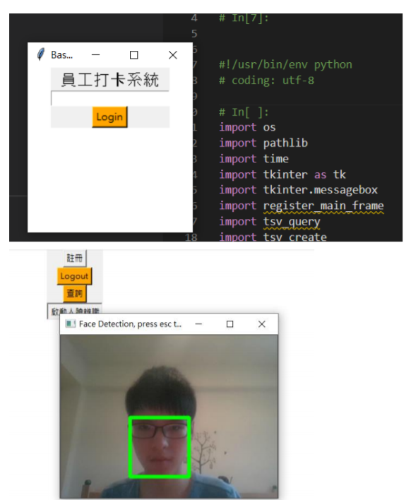

# 1092facedetect
<h2>1092軟體工程</h2>
版本：V0.1 
 
用途：可以作為門禁、打卡功能快速開發 
 
demo： 
  
 
 
相依程式： 
python 3.6.4 x86 (32bit) 
pip install scipy 
pip install dlib 
pip install numpy 
pip install opencv-python 
pip install scikit-image 
pip install matplotlib 
pip install imutils  
pip install pyzbar 
CMAKE 
Webcam 一組 
 
第三方下載： 
　　68特徵：http://dlib.net/files/shape_predictor_68_face_landmarks.dat.bz2 
　　人臉模型：http://dlib.net/files/dlib_face_recognition_resnet_model_v1.dat.bz2 
 
使用方式： 
    1、login.py帶出主畫面
    2、按下註冊按鈕，拍照註冊
    3、啟動人臉辨識
    
 
 
投影片是壓縮檔
 
 
參考資料： 
　  1、https://github.com/shadowjohn/108facedetect
